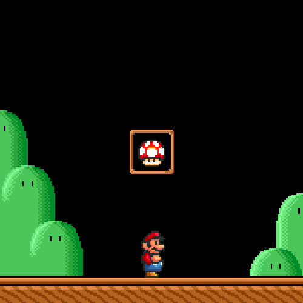

# retro-game-names

[](https://travis-ci.org/GAntoine/retro-game-names)
[](https://codecov.io/github/GAntoine/retro-game-names)
[](http://npm.im/retro-game-names)
[](http://npm-stat.com/charts.html?package=retro-game-names&from=2015-08-01)
[](http://opensource.org/licenses/MIT)
[](https://github.com/semantic-release/semantic-release)

Get random names from retro games!



## Installation

This package is distributed via npm:

```
npm install retro-game-names
```

## Usage
```javascript
import retro from 'retro-game-names'
```

## The Library

#### retro.all

Return an object of platforms, each with an array of titles
```javascript
{
  nintendo_entertainment_system_nes:
    name, tgdb_alias, tgdb_id, [{title, tgdb_id}],
  super_nintendo_snes:
    name, tgdb_alias, tgdb_id, [titles]
}
```

#### retro.platforms()

Returns an array of platform tags
```javascript
const consoles = retro.platforms()
// ['3do', 'amiga', 'acorn_electron', ...]
```

#### retro.info(platform)

Returns all information for the given platform
```javascript
const titles = retro.info('nintendo_entertainment_system_nes')
// { tgdb_id: 7,
//   tgdb_alias: 'nintendo-entertainment-system-nes',
//   name: 'Nintendo Entertainment System (NES)',
//   titles: [{title: '10-Yard Fight', tgdb_id: 317}, {title: '1942', tgdb_id: 4178}, ...]
```

#### retro.random(options = {})

Returns a random game form the game list.
```javascript
const randomGame = retro.random()
// {title: 'Battletoads', tgdb_id: 2770, platform: 'nintendo_entertainment_system_nes'}
```

The `platform` option can be passed in, which will return a random game from that platform
```javascript
const randomGames = retro.random({platform: 'super_nintendo_snes'})
// {title: 'The Adventures of Dr. Franken', tgdb_id: 1050, platform: 'super_nintendo_snes'}
```

Likewise, `platforms` can be used in place of `platform`, and will return a random game from a list of platforms
```javascript
const randomGames = retro.random({platforms: ['super_nintendo_snes', 'sega_cd']})
// {title: 'Armed Dragon Fantasy Villgust - The Vanished Girl', tgdb_id: 23122, platform: 'super_nintendo_snes'}
```

#### retro.find(options = {})

The options hash acceps the following:
 - **title** *(required)*: The partial/exact title of the game (case sensitive)
 - **platform** *(optional)*: The tag of the platform ('super_nintendo_snes', 'sega_cd', etc.)
 - **platforms** *(optional)*: An array of platform tags (['super_nintendo_snes', 'sega_cd'], for example)
 - **ignoreCase** *(optional)*: If true, the search is case-insensitive.

Note: All games returned in the arrays will have the usual format: `{title, tgdb_id}`.

Returns an object with multiple {platform, [titles]}
```javascript
const foundGames = retro.find({title: '-1'})
// { nintendo_entertainment_system_nes: [ 'F-117A Stealth Fighter', 'F-15 Strike Eagle' ],
//  super_nintendo_snes: [ 'GP-1', 'GP-1: Part II', 'Redline F-1 Racer' ] }
```

Passing a platform in the options returns a single {platform, [titles]}
```javascript
const foundGames = retro.find({title: '-1', platform: 'super_nintendo_snes'})
// { platform: 'super_nintendo_snes', titles: [ 'GP-1', 'GP-1: Part II', 'Redline F-1 Racer' ] }
```

Passing `platforms` returns an object of platforms, with a filtered array of titles
```javascript
const foundGames = retro.find({title: '-1', platforms: ['super_nintendo_snes', 'sega_cd']})
// { sega_cd: [ 'A/X-101'], super_nintendo_snes" ['GP-1', 'GP-1: Part II', 'Redline F-1 Racer'] }
```

## Other

This library was built by following [a workshop](http://kcd.im/fem-oss) for
[Frontend Masters](https://frontendmasters.com).

### Project Setup

This project assumes you have [NodeJS v6](http://nodejs.org/) or greater installed. You should
also have [npm v3](https://www.npmjs.com/) or greater installed as well (this comes packaged
with Node 6). You'll also need a recent version of [git](https://git-scm.com/) installed
as well.

```
npm run setup
```

If you get any failures at this point something is wrong and needs to be fixed. Remember,
[Google](https://google.com) and [StackOverflow](https://stackoverflow.com) are your friends.

### Scraper

Included is `scraper.js`, which will scrape platforms/games from TheGamesDB.
```javascript
scraper = require('./tools/scraper.js')
scraper.missing()
```
Using `missing()` is prefered over `all()`, as it will hit TheGamesDB's API only when needed.
